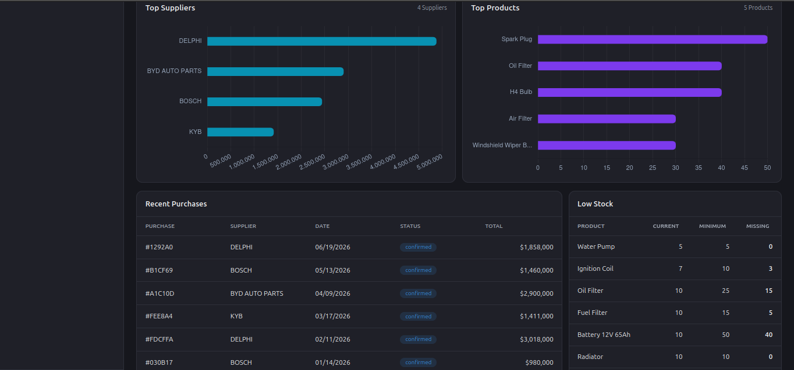
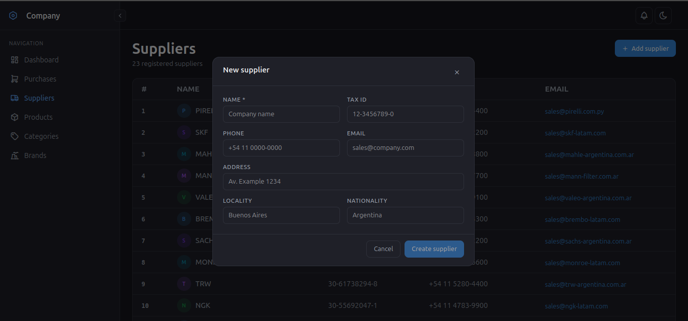

# AutoParts API


## Descripción

**AutoParts API** es el backend de una aplicación de gestión de órdenes de compra. Permite registrar y administrar **productos**, **proveedores**, **marcas** y **categorías**, y expone la información necesaria para generar **reportes y gráficos** que ayudan a evaluar el comportamiento de las compras a lo largo del tiempo (volúmenes por proveedor, distribución por categoría, evolución de precios, etc.).

El proyecto sigue una arquitectura modular inspirada en **Clean Architecture**, separando claramente las reglas de negocio (`domain`) de los detalles técnicos (`infrastructure`, `api`), lo que facilita testear la lógica de forma aislada y cambiar de tecnología (por ejemplo, de PostgreSQL a otro motor) sin reescribir el core de la aplicación.

## Stack y decisiones técnicas

### ¿Por qué FastAPI?

- **Rendimiento**: al estar construido sobre Starlette y Pydantic, y soportar `async`/`await` de forma nativa, FastAPI ofrece un rendimiento comparable a frameworks en Node.js o Go, muy superior a alternativas síncronas tradicionales en Python como Flask.
- **Validación automática de datos**: gracias a Pydantic, cada request y response se valida automáticamente contra los esquemas definidos, reduciendo errores de datos mal formados antes de que lleguen a la lógica de negocio (algo crítico en un sistema que maneja órdenes de compra y montos).
- **Documentación automática**: genera Swagger UI (`/docs`) y ReDoc sin configuración extra, lo que acelera la integración con el frontend Vue y facilita que cualquier persona del equipo pruebe los endpoints sin herramientas adicionales.
- **Tipado fuerte**: el uso de type hints de Python no solo mejora el autocompletado y la detección temprana de errores, sino que es la base de la validación y la generación de documentación.
- **Inyección de dependencias nativa**: el sistema de `Depends` de FastAPI simplifica manejar sesiones de base de datos, autenticación y reglas de negocio reutilizables entre rutas.

### ¿Por qué SQLAlchemy?

- **Independencia del motor de base de datos**: SQLAlchemy actúa como una capa de abstracción sobre SQL, permitiendo que la lógica de negocio no dependa directamente de PostgreSQL. Si en el futuro se necesita migrar a otro motor, el impacto se limita a la capa de infraestructura.
- **ORM maduro y flexible**: permite trabajar con modelos como objetos Python (mapeo objeto-relacional) sin perder la posibilidad de escribir consultas SQL complejas cuando se necesitan, algo clave para los reportes y agregaciones que alimentan los gráficos.
- **Integración con Alembic**: al usar el mismo ecosistema, las migraciones de esquema (crear/alterar tablas de productos, proveedores, marcas, categorías) quedan versionadas y son reproducibles en cualquier entorno.
- **Manejo de relaciones**: las relaciones entre productos, proveedores, marcas y categorías (uno a muchos, muchos a muchos) se modelan de forma declarativa y clara, evitando escribir joins manuales repetidamente.
- **Compatibilidad con patrones de repositorio**: encaja naturalmente con la capa `infrastructure/repositories`, permitiendo desacoplar el acceso a datos del dominio mediante interfaces (`domain/repositories`).

### ¿Por qué Docker para la base de datos?

- **Entorno reproducible**: cualquier persona que clone el repo levanta exactamente la misma versión de PostgreSQL, con la misma configuración, sin instalar nada en su sistema operativo ni lidiar con "en mi máquina funciona".
- **Aislamiento**: la base de datos corre en su propio contenedor, separada del proceso de la API y del sistema host. Si se rompe algo (una migración fallida, datos corruptos en pruebas), se destruye el contenedor y se vuelve a levantar sin afectar el resto del entorno.
- **Persistencia controlada con volúmenes**: los datos de PostgreSQL se guardan en un **volumen de Docker**, no dentro del contenedor. Esto permite borrar y recrear el contenedor (`docker compose down`) sin perder la información, y borrar solo el volumen (`docker volume rm`) cuando se quiere empezar de cero.
- **Orquestación simple con docker-compose**: en un solo archivo (`docker-compose.yml`) se define la API, la base de datos y cómo se comunican entre sí (red interna, variables de entorno, dependencias de arranque), evitando configurar cada pieza a mano.
- **Paridad entre entornos**: el mismo `docker-compose.yml` que se usa en desarrollo puede adaptarse para staging o producción, reduciendo diferencias de comportamiento entre entornos.

#### ¿Cómo funcionan sus capas?

Docker trabaja con dos conceptos de "capas" distintos que conviene diferenciar:

**1. Capas de la imagen (filesystem en capas)**

Cada instrucción del `Dockerfile` (`FROM`, `RUN`, `COPY`, etc.) genera una **capa** de solo lectura que se apila sobre la anterior, usando un sistema de archivos por unión (*union filesystem*, ej. OverlayFS):

```
Dockerfile                      Capas resultantes
─────────────────               ─────────────────────────
FROM python:3.12-slim   ──►     Capa 1: SO base + Python
COPY requirements.txt   ──►     Capa 2: archivo de deps
RUN pip install -r ...  ──►     Capa 3: librerías instaladas
COPY app/ ./app/        ──►     Capa 4: código de la app
```

- Docker **cachea cada capa**: si no cambiaste `requirements.txt`, en el próximo build reutiliza la Capa 3 tal cual, sin reinstalar dependencias. Por eso conviene copiar `requirements.txt` e instalar dependencias **antes** de copiar el código de la app, que cambia mucho más seguido.
- Cuando el contenedor corre, Docker agrega una **capa de escritura** encima de todas las de solo lectura, donde se guardan los cambios en tiempo de ejecución. Esa capa se pierde si el contenedor se elimina.

**2. Capas de la arquitectura del proyecto (docker-compose)**

A nivel de `docker-compose.yml`, el proyecto queda organizado en "capas" de servicios que se comunican entre sí:

```
┌───────────────────────────────────────────────┐
│  Red interna de Docker (network)              │
│                                               │
│   ┌──────────────┐       ┌───────────────┐    │
│   │ autoparts-api│ ───►  │ autoparts-db  │    │
│   │  (FastAPI)   │       │ (PostgreSQL)  │    │
│   └──────────────┘       └─────────┬─────┘    │
│                                    │          │
└────────────────────────────────────┼──────────┘
                                     ▼
                          ┌─────────────────────┐
                          │ Volumen persistente │
                          │  (datos de la DB)   │
                          └─────────────────────┘
```

- **Servicio `api`**: corre la aplicación FastAPI, expone el puerto `8000` al host.
- **Servicio `db`**: corre PostgreSQL, expone el puerto `5432` (opcionalmente solo dentro de la red interna).
- **Red interna**: docker-compose crea una red por defecto donde los servicios se ven entre sí por nombre (la API se conecta a la DB usando el hostname `autoparts-db`, no `localhost`).
- **Volumen**: persiste los datos de PostgreSQL fuera del ciclo de vida del contenedor, para que sobrevivan a un `docker compose down` sin `-v`.
- **Orden de arranque**: con `depends_on` se controla que el contenedor de la API espere a que el de la base de datos esté disponible antes de intentar conectarse.

## Guía paso a paso por consola

```bash
# 00. Configurar el entorno virtual de Python e instalar dependencias
python3 -m venv .venv

source .venv/bin/activate

pip install -r requirements.txt

pip freeze > requirements.txt


# 01. Liberar los puertos que se van a usar (si están ocupados) y levantar el proyecto
sudo lsof -i

sudo kill -9 <PID>

docker compose up -d --build


# 02. Verificar con Swagger que esté funcionando correctamente.
# Revisar los logs. Si es la primera vez, ejecutar el Bootstrap.
http://localhost:8000/docs

docker logs -f autoparts-api

docker logs -f autoparts-db

docker exec -it autoparts-api python -m app.scripts.seed

docker compose up -d

docker compose stop


# 03. Si hay un error en el paso anterior,
# hay que eliminar el contenedor y su volumen asociado.
docker compose down

docker volume ls

docker volume rm <NAME_VOLUME>

# 04. Verificación
docker exec -it autoparts-db psql -U admin -d autoparts
\dt
```

## Captura de pantalla



